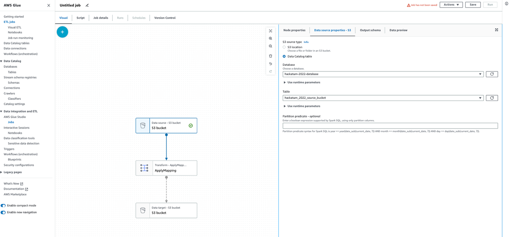

# Hackatum-2022 -- Data Integration and Transformation with AWS

# What is AWS Glue?

AWS Glue is a fully managed ETL (Extract, Transform, Load) service provided by Amazon Web Services. It allows you to create, run, and monitor ETL jobs on large data sets stored in Amazon S3, RDS, Redshift, and other data stores.

Here are some of the key features of AWS Glue:

- Serverless architecture: AWS Glue is a fully managed service, which means that you do not need to manage any infrastructure. It automatically scales up or down based on the amount of data being processed, which helps reduce costs.
- ETL jobs and workflows: AWS Glue allows you to create and run ETL jobs and workflows on a variety of data sources. You can create and schedule jobs to run on a regular basis, or you can run them on demand.
- Data Catalog: AWS Glue provides a centralised metadata repository called the Data Catalog. This allows you to store metadata about your data sources, including schemas, partitions, and transformations. This metadata is used by AWS Glue to generate ETL scripts automatically, which helps reduce the amount of time and effort required to create ETL jobs.
- Integration with other AWS services: AWS Glue integrates with a variety of other AWS services, including Amazon S3, Amazon RDS, Amazon Redshift, and Amazon EMR. This allows you to easily move data between different services and perform ETL operations on them.
- Automatic schema discovery: AWS Glue automatically discovers the schema of your data sources, which helps reduce the amount of time and effort required to create ETL jobs.
- Cost-effective: AWS Glue is a cost-effective solution for ETL jobs. You only pay for the resources you use, and there are no upfront costs or long-term commitments.

Overall, AWS Glue is a powerful and flexible ETL service that allows you to easily process and move data between different data sources. It provides a range of features that can help you automate and simplify your ETL workflows, which can help you save time and reduce costs.

## Crawlers:

Crawler is a fully managed ETL (Extract, Transform, and Load) service that automatically discovers, categorises, and maps data stored in various data sources. It is a serverless data integration service that makes it easy to move data between data stores and data warehouses.

The crawler works by automatically scanning data sources, such as Amazon S3, relational databases, and NoSQL databases, to determine the data schema and metadata, such as field types, primary keys, and relationships. Once the schema is determined, the crawler creates a metadata table in the AWS Glue Data Catalog. This table can then be used by other AWS Glue services, such as ETL jobs, to process and analyse the data.

Crawlers supports a wide range of data sources, including popular databases such as MySQL, PostgreSQL, and Oracle, as well as file-based data sources such as CSV, Parquet, and Avro. It also provides support for nested data structures, making it easy to process and analyze complex data types such as JSON and XML.

One of the key benefits of Crawler is its ability to automate the data discovery process. This eliminates the need for manual schema discovery, which can be time-consuming and error-prone. Additionally, AWS Glue Crawler provides a centralized metadata repository that can be used by other services in the AWS Glue ecosystem.

Crawler is a powerful tool for data integration and analysis, providing a simple and efficient way to automate the discovery and mapping of data sources.

# Step-by-step demonstration of AWS Crawlers

1. **Create Input datasource**: We are using S3 in this example
  

  

2. **Upload data**: Next, upload some sample data to the S3 bucket. You can create a simple CSV or JSON file
 

   

    

  

3. **Create an IAM role**: Create an IAM role with permissions to access your S3 bucket. The crawler will use this role with the attached policy to access your data
 

  

f
  

4. **Create a database**: Create a database in the AWS Glue Data Catalog where your data will be stored
 

f
  

5. **Create a crawler**: Now, create a new AWS Glue crawler by going to the AWS Glue console and clicking "Crawlers" in the left-hand navigation menu. Click "Create crawler" and enter a name for your crawler. Under "Data store", select "S3" and enter the path to your S3 bucket. Under "Choose an existing IAM role", select the IAM role you created in step-3. Under "Frequency", you can choose how often you want the crawler to run. Finally, under "Targets", select the database you created in step-4
 

f
  

6. **Run the crawler**: After creating the crawler, you can run it by selecting it from the list of crawlers and clicking "Run crawler". The crawler will scan your S3 bucket for data and automatically create tables in the database you specified. You can also view logs of the performed activity in the cloud watch
 

f
  

7. **Query the data**: Now that your data is cataloged in the AWS Glue Data Catalog, you can use it in your analytics and data processing workflows. To do this, you can use SQL queries or tools like AWS Glue ETL jobs to transform and analyze your data
 

f
  

# Step-by-step demonstration of AWS Glue ETL Jobs

1. **Navitage to the console**: Go to the AWS Glue console and select "Jobs" from the left navigation menu, and then click create job
 

f
  

2. **Choose your datasource:**: It could be from S3 or Data Catalog Table
 

f
  

3. **Apply data transform:** Apply data transform in relation to your data
 

f
  

5. **Add data target:** Configure the data target as shown
 

f
  

6. **Do remaining configurations:** You can configure job properties, including the number of workers, maximum capacity, and job parameters. Add the permissions for S3 read and write to the destination bucket
 

f
  

f
  

This ends up the practical demonstration of AWS Glue and setting up of crawlers.

